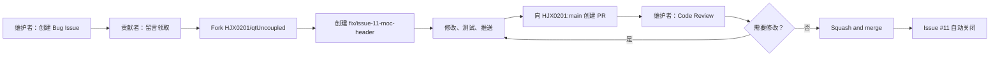
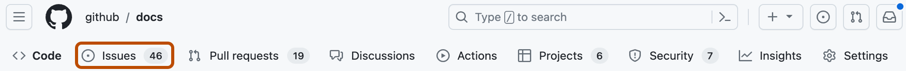
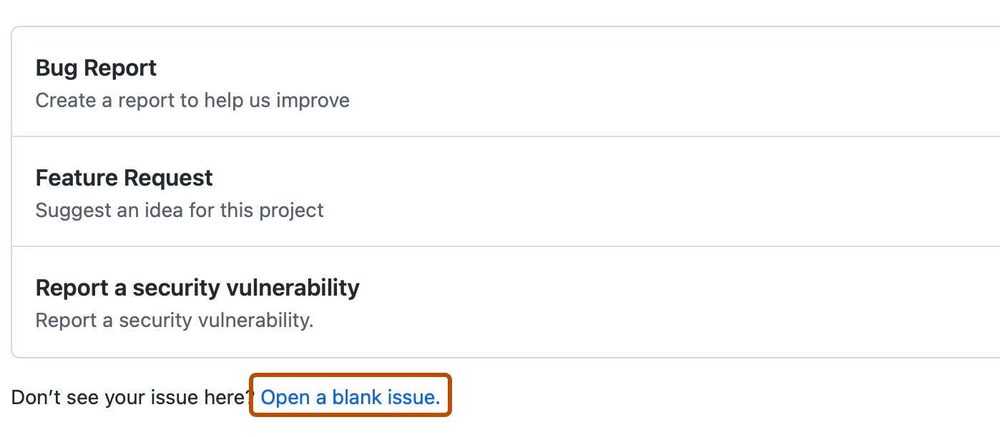
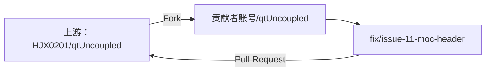
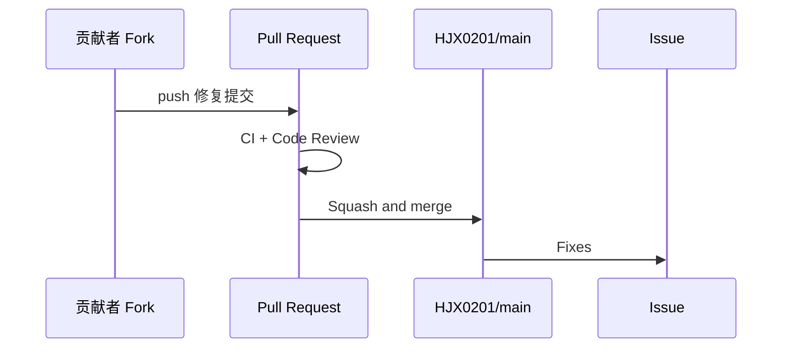

# GitHub Bug 修复协作实战

本教程面向第一次参与 GitHub 协作开发的人，使用本仓库的真实教学缺陷
[Issue #11](https://github.com/HJX0201/qtUncoupled/issues/11)，演示从发现问题到合并修复的完整流程。

教学缺陷由 [PR #10](https://github.com/HJX0201/qtUncoupled/pull/10) 有意引入：
快速验证仍然通过，但摘要表最后一列把“新方案MOC”错误显示为“旧方案MOC”。
这不会改变基准算法和测试行为，适合用来练习 Issue、Fork、Pull Request 和 Code Review。

> Issue #11 当前不主动分配给任何人。准备处理前，请先在 Issue 中留言，避免重复开发。

## 一张图看懂全过程



| 角色 | 使用的仓库 | 主要职责 |
|---|---|---|
| 维护者 `HJX0201` | 上游仓库 `HJX0201/qtUncoupled` | 建立 Issue、评审、合并 |
| 外部贡献者 | 自己账号下的 Fork | 创建修复分支、实现、测试、提交 PR |
| Windows CI | 上游 PR | 自动编译并测试两种方案 |

## 第 1 步：维护者建立 Bug Issue

**当前角色：** 维护者。

**网页路径：** 仓库首页 → `Issues` → `New issue`。



如果仓库没有 Bug 模板，选择 `Open a blank issue`。



本次练习已经创建 [Issue #11](https://github.com/HJX0201/qtUncoupled/issues/11)，其中包含：

- 问题现象与复现步骤；
- 实际结果与预期结果；
- 快速验证和 CI 验收标准；
- 建议分支名；
- 不得提交构建产物和原始日志的要求。

**预期结果：** Issue 为 `Open`，`Assignees` 为空，带有 `bug` 标签。

**常见错误：** 把包含用户名、本机路径、令牌或企业信息的原始日志粘贴到公开 Issue。

## 第 2 步：贡献者领取任务并 Fork

**当前角色：** 外部贡献者。

1. 打开 [Issue #11](https://github.com/HJX0201/qtUncoupled/issues/11)。
2. 确认没有其他开放 PR 正在处理同一问题。
3. 留言说明准备处理，例如：“已复现，我来处理。”
4. 回到仓库首页，点击右上角 `Fork`，在自己账号下创建副本。

外部贡献者没有上游仓库写权限，因此修改先推送到自己的 Fork：



**预期结果：** 浏览器进入 `贡献者账号/qtUncoupled`，文件内容与上游一致。

**常见错误：** 只收藏仓库而没有 Fork；或者在没有写权限的上游仓库尝试直接创建分支。

## 第 3 步：克隆 Fork 并连接上游仓库

**当前角色：** 外部贡献者。

将下面的 `贡献者账号` 替换为自己的 GitHub 用户名：

```powershell
git clone https://github.com/贡献者账号/qtUncoupled.git
Set-Location qtUncoupled
git remote add upstream https://github.com/HJX0201/qtUncoupled.git
git remote -v
```

正常情况下：

```text
origin    → 贡献者自己的 Fork，用于 push
upstream  → HJX0201 的上游仓库，用于同步 main
```

从最新上游 `main` 创建修复分支：

```powershell
git fetch upstream
git switch -c fix/issue-11-moc-header upstream/main
```

**预期结果：** `git branch --show-current` 输出 `fix/issue-11-moc-header`。

**常见错误：** 直接在 `main` 上修改；或者从长期未更新的 Fork 分支创建修复分支。

## 第 4 步：复现并修复错误

**当前角色：** 外部贡献者。

先运行快速验证，确认问题可以复现：

```powershell
.\Run-Benchmark.ps1 -Quick
```

在命令输出或最新的 `benchmark-results/<时间戳>/summary.md` 中，可以看到：

```text
| 干净编译变化 | 单实现增量变化 | UI头变化 | 旧方案MOC |
```

但这一列的数值来自 `$mocCounts['string_registry']`，所以表头应为“新方案MOC”。在
`Run-Benchmark.ps1` 中只修正这一处文字，不改变数值来源或基准逻辑：

```text
旧方案MOC → 新方案MOC
```

完成后重新验证：

```powershell
.\Run-Benchmark.ps1 -Quick
.\scripts\Test-PublicRelease.ps1
git diff --check
git status --short
git diff -- Run-Benchmark.ps1
```

**预期结果：** 快速验证和公开发布检查通过，Git diff 只有一处表头文字修正。

**常见错误：** 提交 `benchmark-builds/`、`benchmark-results/` 或包含本机环境的日志。

## 第 5 步：提交并推送修复分支

**当前角色：** 外部贡献者。

```powershell
git add Run-Benchmark.ps1
git commit -m "fix: correct MOC summary header"
git push -u origin fix/issue-11-moc-header
```

**预期结果：** GitHub 上自己的 Fork 出现 `fix/issue-11-moc-header` 分支，并显示
`Compare & pull request`。

**常见错误：** 使用 `git add .` 把无关文件一起加入提交；或者把修复推送到自己的 `main`。

## 第 6 步：在网页创建 Pull Request

**当前角色：** 外部贡献者。

推送新分支后，回到 Fork 首页，点击黄色提示条中的 `Compare & pull request`。


确认比较方向：

```text
base repository: HJX0201/qtUncoupled
base: main
head repository: 贡献者账号/qtUncoupled
compare: fix/issue-11-moc-header
```

PR 标题建议使用：

```text
fix: correct MOC summary header
```

PR 正文可以写成：

```markdown
## 变更

- 将摘要表错误的“旧方案MOC”恢复为“新方案MOC”
- 不改变 MOC 数值来源和基准计算

## 验证

- [x] `.\Run-Benchmark.ps1 -Quick`
- [x] `.\scripts\Test-PublicRelease.ps1`
- [x] `git diff --check`

## 风险

仅修正文案，不改变程序行为。

Fixes #11
```

确认修改完成后点击 `Create pull request`；仍在开发时才使用 `Create draft pull request`。

**预期结果：** 上游仓库出现一个以 `main` 为目标的开放 PR，Issue #11 的
`Development` 区域显示该 PR。

**常见错误：** 把 `base` 和 `compare` 选反；漏写 `Fixes #11`；尚未完成却创建可评审 PR。

## 第 7 步：维护者进行 Code Review

**当前角色：** 维护者。

打开 PR 后，先检查 `Conversation` 中的目标、验证结果和 Windows CI，再点击 `Files changed`。


本次修复理想情况下只有一行：

```diff
- | ... | 旧方案MOC |
+ | ... | 新方案MOC |
```

评审者可以把鼠标移到代码行号旁，点击蓝色 `+` 添加行级评论。检查完成后点击
`Review changes`。


选择评审结论：

- `Comment`：普通说明，不表示批准或拒绝；
- `Approve`：同意合并；
- `Request changes`：要求作者先修改。

**预期结果：** PR 显示维护者的评审结论；PR 作者不能批准自己的 PR。

**常见错误：** 只看 PR 描述而不看 `Files changed`；CI 尚未完成就合并；把无关改进塞进本次修复。

## 第 8 步：处理评审意见

**当前角色：** 外部贡献者。

如果维护者要求修改，继续使用原来的本地分支：

```powershell
git switch fix/issue-11-moc-header
# 修改并重新验证
git add Run-Benchmark.ps1
git commit -m "fix: address review feedback"
git push
```

新的提交会自动进入原 PR，不要另开一个 PR。处理完成后回复对应评论，说明修改和验证结果。

## 第 9 步：合并并关闭 Issue

**当前角色：** 维护者。

满足以下条件后再合并：

- PR 不是 Draft；
- 两组 Windows CI 均通过；
- 没有未解决的评审意见；
- 修改范围符合 Issue #11；
- PR 正文包含 `Fixes #11`。

在 PR `Conversation` 底部选择 `Squash and merge`，确认提交标题后点击
`Confirm squash and merge`，最后删除修复分支。



**预期结果：** PR 状态变为 `Merged`，Issue #11 状态变为 `Closed`。

**常见错误：** 使用管理员权限绕过失败的检查；合并后忘记删除已完成的远程分支。

## 第 10 步：贡献者清理并同步 Fork

**当前角色：** 外部贡献者。

```powershell
git switch main
git fetch upstream
git merge --ff-only upstream/main
git push origin main
git branch -d fix/issue-11-moc-header
```

至此，一个完整的合作开发循环结束：

```text
Issue 明确问题 → Fork 隔离权限 → 分支隔离修改 → PR 展示差异
→ CI 自动验证 → Review 人工把关 → Merge 进入主线 → Issue 关闭
```

## 快速检查清单

### 贡献者

- [ ] 开始前已在 Issue 留言，没有重复开发。
- [ ] 从最新 `upstream/main` 创建独立分支。
- [ ] 只提交与 Issue 相关的修改。
- [ ] 快速验证、公开发布检查和 `git diff --check` 均通过。
- [ ] PR 目标为 `HJX0201/qtUncoupled:main`。
- [ ] PR 正文包含 `Fixes #11`。

### 维护者

- [ ] 已阅读 Issue 的验收标准。
- [ ] 已检查 `Files changed`，而不是只读 PR 描述。
- [ ] 两组 Windows CI 均通过。
- [ ] 没有敏感信息、构建产物或无关修改。
- [ ] 评审意见已解决后才合并。

## 图片来源与许可

部分 GitHub 界面截图来自 [GitHub Docs](https://docs.github.com/)，依据
[Creative Commons Attribution 4.0 International](https://creativecommons.org/licenses/by/4.0/)
许可使用，图片保持原样。

- `github-issues-tab.png`、`github-open-blank-issue.png`：
  [Creating an issue](https://docs.github.com/en/issues/tracking-your-work-with-issues/using-issues/creating-an-issue)
- `github-compare-pull-request.png`：
  [Creating a pull request](https://docs.github.com/en/pull-requests/how-tos/create-pull-requests/creating-a-pull-request)
- `github-files-changed-tab.png`、`github-review-changes-button.png`：
  [Reviewing proposed changes](https://docs.github.com/en/pull-requests/how-tos/review-pull-requests/reviewing-proposed-changes-in-a-pull-request?tool=webui)
- 合并步骤参考：
  [Merging a pull request](https://docs.github.com/en/pull-requests/how-tos/merge-and-close-pull-requests/merging-a-pull-request)

GitHub Docs 仓库说明其 `assets`、`content` 和 `data` 内容采用 CC BY 4.0：
[github/docs](https://github.com/github/docs)。
